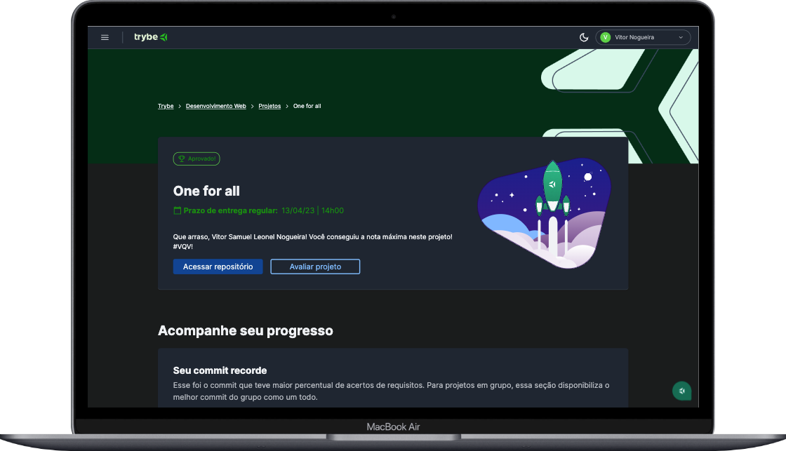

## One for All



---
<details>
<summary><span style="font-size: 1.5rem;"> 👨🏼‍💻 Proposta</span></summary>
  - Normalizar a tabela do banco de dados do Spotify para 1FN, 2FN, e 3FN; </br>
  - Criar um banco de dados relacional <code>SpotifyClone</code>; </br>
  - Criar as tabelas que foram normalizadas e adicionar ao banco criado; </br>
  - Escrever várias querys para extrair informações específicas;
</details>

---
<details>
<summary><span style="font-size: 1.5rem;"> 📝 Funcionalidades</span></summary>
  - Manipulação banco de dados MySQL - <code>SpotifyClone</code>; </br>
  - Pesquisas e filtros, utilizando funções de agregação, Group By, condicionais e manipulação de datas; </br>
  - Manipulação de várias tabelas com <code>INNER JOIN</code>;
</details>

---
<details>
<summary><span style="font-size: 1.5rem;"> 💡 Tecnologias Utilizadas</span></summary>
  - MySQL </br>
  - Docker 
</details>

----
### Como executar o projeto
> ⚠️ É necessário ter o Docker e MySQL para executar o projeto
1. Clone este repositório
````
git clone git@github.com:vitor-nogueira-dev/one-for-all.git
````
2. Na pasta raiz do projeto, execute o seguinte comando para instalar as dependências:
```
npm install
``` 
3. Ainda na pasta raiz do projeto suba o container: 
````
docker-compose up -d
````
4. Crie o banco de dados com os comandos do arquivo `desafio1.sql`;
5. Depois que o banco estiver criado você pode copiar as queries dos arquivos `desafio2...9` e testar no seu ambiente MySQL;
6. Para testar as queries dos `desafios11...13` adicione uma nova tabela ao banco com os comandos contidos no arquivo `desafio10.sql`;

### Contribuições
> 💡Contribuições são bem-vindas! Se você tiver alguma sugestão ou encontrar um bug, por favor, abra uma issue ou envie um pull request.


